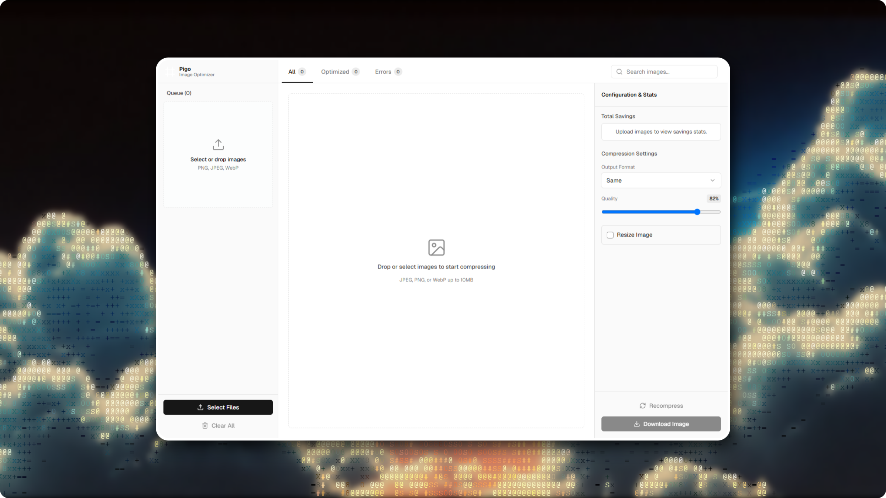

# Pigo



A minimal-dependency, minimal-configuration image optimizer with a Go API backend and a Next.js web frontend.

---

## Features

- **Hybrid Optimization** — Compresses WebP directly in the browser via Canvas APIs, and delegates JPEG/PNG compression and scaling to the Go backend.
- **Go API Backend** — Fast, low-overhead REST API server written in Go utilizing native codecs and Catmull-Rom interpolation for resizing.
- **Modern Next.js Frontend** — Beautiful, responsive user interface featuring drag-and-drop uploads, clipboard pasting, bulk downloads, and an interactive comparison slider.
- **Zero Heavy Runtime Dependencies** — No external C-libraries, GraphicsMagick, or libvips required to compile or run the backend.
- **Monorepo Ready** — Structured as a Turborepo monorepo powered by Bun for fast builds and workspace package management.

## Tech Stack

- **Backend**: Go (1.26+), [`chi`](https://github.com/go-chi/chi) router, `golang.org/x/image/draw`
- **Frontend**: Next.js (16.2+), React 19, Tailwind CSS v4, Lucide Icons, JSZip
- **Tooling**: Bun, Turborepo, [Ultracite](https://github.com/PunGrumpy/ultracite) (Oxlint + Oxfmt), Air (Go hot-reloading)

## Project Structure

```text
pigo/
├── apps/
│   ├── api/            # Go REST API backend (Port 3001)
│   └── web/            # Next.js web frontend (Port 3000)
├── packages/
│   └── typescript-config/ # Shared TypeScript configs
└── package.json        # Workspace configuration
```

## Getting Started

### Prerequisites

Make sure you have the following installed:

- [Go](https://go.dev/doc/install) (1.26 or later)
- [Bun](https://bun.sh) (1.3.14 or later)
- [Air](https://github.com/air-verse/air) (Optional, for API hot-reloading)

### Installation

1. Clone the repository:

   ```bash
   git clone https://github.com/PunGrumpy/pigo.git
   cd pigo
   ```

2. Install dependencies:
   ```bash
   bun install
   ```

### Development

Run both the Go API backend and the Next.js frontend concurrently:

```bash
bun dev
```

- **Frontend**: http://localhost:3000
- **API Backend**: http://localhost:3001

### Formatting and Linting

This project uses **Ultracite** (Oxlint + Oxfmt) to enforce strict code standards and formatting:

- Check for code issues:
  ```bash
  bun run check
  ```
- Automatically fix code formatting and linting issues:
  ```bash
  bun run fix
  ```

---

## API Specification

### POST `/compress`

Optimizes and resizes a JPEG/PNG image.

- **Content-Type:** `multipart/form-data`

#### Request Parameters

| Parameter        | Type    | Required | Default  | Description                                                                        |
| :--------------- | :------ | :------- | :------- | :--------------------------------------------------------------------------------- |
| `file`           | File    | Yes      | -        | The image file to optimize (Max size: `10MB`). Supported formats: JPEG, PNG, WebP. |
| `quality`        | Integer | No       | `82`     | Target image quality from `1` to `100`.                                            |
| `outputFormat`   | String  | No       | `"same"` | Target image format: `"same"`, `"jpeg"`, or `"png"`.                               |
| `resizeWidth`    | Integer | No       | -        | Target width in pixels (`1`-`16384`).                                              |
| `resizeHeight`   | Integer | No       | -        | Target height in pixels (`1`-`16384`).                                             |
| `maintainAspect` | Boolean | No       | `true`   | Maintain aspect ratio when resizing (`"true"` or `"false"`).                       |

#### Response Headers

| Header              | Type    | Description                                   |
| :------------------ | :------ | :-------------------------------------------- |
| `X-Original-Size`   | Integer | Size of the original image in bytes.          |
| `X-Compressed-Size` | Integer | Size of the optimized image in bytes.         |
| `X-Elapsed-Ms`      | Integer | Processing duration in milliseconds.          |
| `X-Width`           | Integer | Resized width of the output image in pixels.  |
| `X-Height`          | Integer | Resized height of the output image in pixels. |

### GET `/health`

Returns the health status of the API backend.

**Response:**

```json
{
  "status": "ok"
}
```
