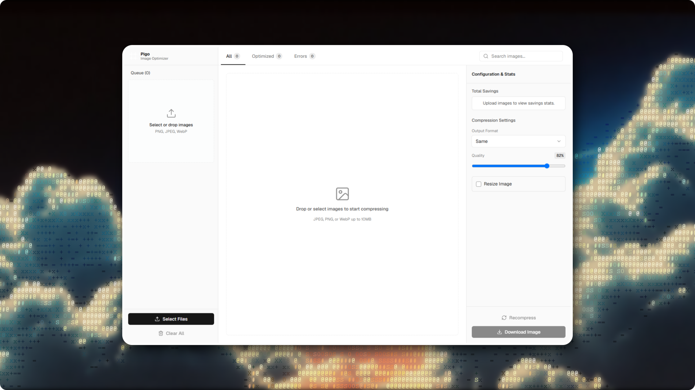

# Pigo



A minimal-dependency, minimal-configuration image optimizer with a Go API backend and a Next.js web frontend.

## Features

- **Hybrid optimization**: The browser encodes WebP through the Canvas API, and the Go backend compresses and resizes JPEG and PNG.
- **Go API backend**: A REST server built on the standard library's JPEG and PNG codecs, with Catmull-Rom interpolation for resizing.
- **Next.js frontend**: Drag-and-drop uploads, clipboard paste, ZIP downloads, and a before/after comparison slider.
- **Zero heavy runtime dependencies**: The backend builds and runs without C libraries, GraphicsMagick, or libvips.
- **Turborepo monorepo**: Bun workspaces handle builds and package management.

## Tech stack

- **Backend**: Go (1.26+), [`chi`](https://github.com/go-chi/chi) router, `golang.org/x/image/draw`
- **Frontend**: Next.js (16.3+), React 19, Tailwind CSS v4, Lucide Icons, JSZip
- **Tooling**: Bun, Turborepo, [Ultracite](https://github.com/PunGrumpy/ultracite) (Oxlint + Oxfmt), Air (Go hot-reloading)

## Project structure

```text
pigo/
├── apps/
│   ├── api/                 # Go REST API backend (port 3001)
│   └── web/                 # Next.js web frontend (port 3000)
├── packages/
│   ├── core/                # Go image decoding, encoding, and resizing
│   └── typescript-config/   # Shared TypeScript configs
└── package.json             # Workspace configuration
```

## Getting started

### Prerequisites

Make sure you have the following installed:

- [Go](https://go.dev/doc/install) (1.26 or later)
- [Bun](https://bun.sh) (1.3.14 or later)
- [Air](https://github.com/air-verse/air), optional, for API hot-reloading

### Installation

1. Clone the repository:

   ```bash
   git clone https://github.com/PunGrumpy/pigo.git
   cd pigo
   ```

2. Install dependencies:

   ```bash
   bun install
   ```

### Development

Run the Go API backend and the Next.js frontend together:

```bash
bun dev
```

- **Frontend**: `http://localhost:3000`
- **API backend**: `http://localhost:3001`

### Configuration

The API reads its settings from the process environment. Set these variables before you start the API; `apps/api/.env.example` documents each one.

| Variable | Default | Description |
| :-- | :-- | :-- |
| `PORT` | `3001` | Port the API listens on. |
| `CORS_ALLOWED_ORIGINS` | `http://localhost:3000, http://127.0.0.1:3000, https://pigo-web.vercel.app` | Comma-separated origins the API allows for CORS. Entries of the form `https://*.example.com` match one subdomain level. |

### Formatting and linting

This project uses Ultracite (Oxlint + Oxfmt) to enforce code standards and formatting.

Report every issue without changing files:

```bash
bun run check
```

Rewrite files to fix what can be fixed automatically:

```bash
bun run fix
```

## API specification

### POST `/compress`

Optimizes and resizes a JPEG or PNG image.

- **Content-Type**: `multipart/form-data`

#### Request parameters

| Parameter | Type | Required | Default | Description |
| :-- | :-- | :-- | :-- | :-- |
| `file` | File | Yes | - | The image file to optimize, up to `20 MB`. Supported formats: JPEG, PNG, WebP. |
| `quality` | Integer | No | `82` | Target image quality from `1` to `100`. |
| `outputFormat` | String | No | `"same"` | Target image format: `"same"`, `"jpeg"`, or `"png"`. |
| `resizeWidth` | Integer | No | - | Target width in pixels, `1` to `16384`. |
| `resizeHeight` | Integer | No | - | Target height in pixels, `1` to `16384`. |
| `maintainAspect` | Boolean | No | `true` | Maintain aspect ratio when resizing, `"true"` or `"false"`. |

#### Notes

- The browser produces WebP output, not the API. A WebP upload with `outputFormat` set to `"same"` (the default) or `"webp"` returns `400`. Convert WebP through the API only to `"jpeg"` or `"png"`.
- The API rejects GIF input with `400`.
- The API accepts images up to 100 megapixels and 16384 pixels per side.

#### Response headers

| Header              | Type    | Description                                  |
| :------------------ | :------ | :------------------------------------------- |
| `X-Original-Size`   | Integer | Size of the original image in bytes.         |
| `X-Compressed-Size` | Integer | Size of the optimized image in bytes.        |
| `X-Elapsed-Ms`      | Integer | Processing duration in milliseconds.         |
| `X-Output-Format`   | String  | Format of the output image, `jpeg` or `png`. |
| `X-Width`           | Integer | Width of the output image in pixels.         |
| `X-Height`          | Integer | Height of the output image in pixels.        |

### GET `/health`

Returns the health status of the API backend.

Response:

```json
{
  "status": "ok"
}
```
